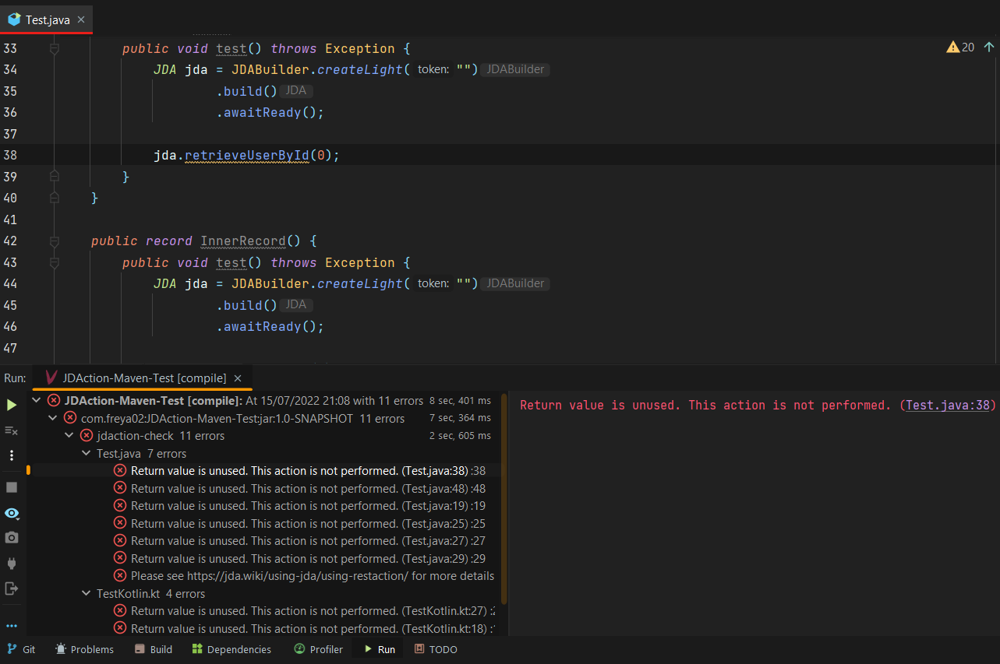

# JDAction - Correct JDA RestAction usage enforcer

This is a Maven plugin alternative to the already existing [JDAction plugin for Gradle](https://github.com/JDA-Applications/jdaction), which makes sure that rest actions are used.

The plugin will make sure that all your rest actions are used, 
though this will only catch errors where the rest action is not stored in a variable, not being returned or isn't executed via `queue`, `complete` or `submit`

## Usage

You can add the plugin in your `plugins` tag:
```xml
<project [...]>
    [...]

    <build>
        [...]
        <plugins>
            [...]
            <plugin> <!-- This plugin needs to be added last -->
                <groupId>com.freya02</groupId>
                <artifactId>jdaction-maven-plugin</artifactId>
                <version>VERSION</version>
                <executions>
                    <execution>
                        <goals>
                            <goal>jdaction-check</goal>
                        </goals>
                    </execution>
                </executions>
            </plugin>
        </plugins>
    </build>
</project>
```

## FAQ

### Does it works with Kotlin ?
Yes, the plugin works with any JVM language

### Can I make the plugin output warnings instead of errors ?
Yes, you can add the `configuration` tag to the plugin:
```xml
<plugin>
    <groupId>com.freya02</groupId>
    <artifactId>jdaction-maven-plugin</artifactId>
    <version>VERSION</version>
    [...]
    <configuration>
        <ignoreFailures>true</ignoreFailures>
    </configuration>
</plugin>
```

### How are errors reported ?
The errors are reported in your maven logs, if you use an IDE such as IntelliJ or Eclipse, they should also appear there.
